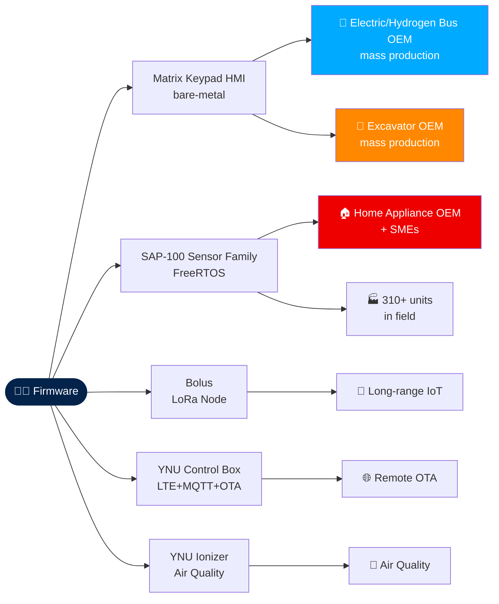
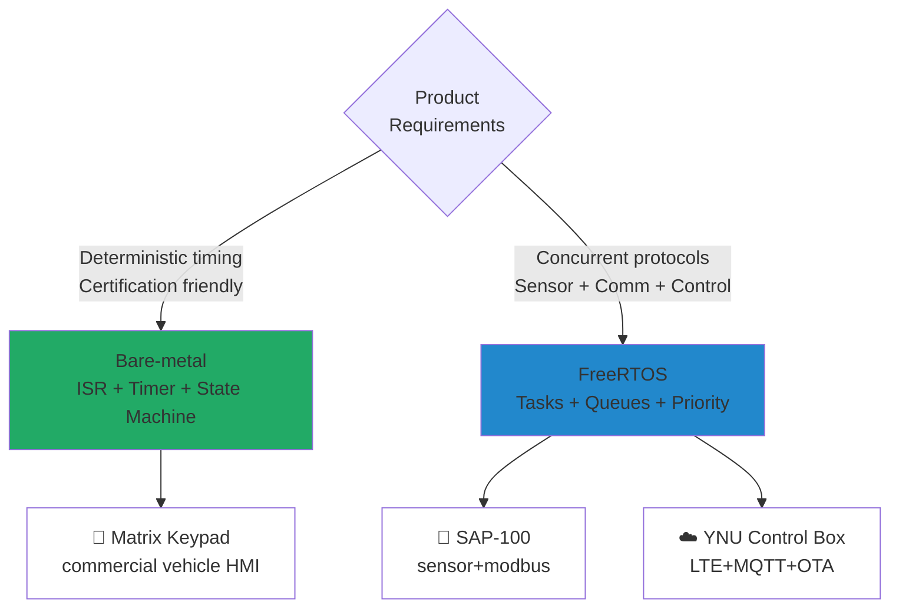

<!--
  Upload this file as README.md to your github.com/<changhoon-yoon>/<changhoon-yoon> repo.
  It will render as your GitHub profile homepage. Mermaid diagrams are rendered
  automatically by GitHub.

  ⚠️ Before uploading:
  1. Replace <changhoon-yoon> in the links below with your actual GitHub handle
  2. The "Featured Projects" section lists planned/ongoing demo repos.
     Only keep the entries that have actual repos — otherwise visitors hit 404.
-->

<h1 align="center">👋 Hi, I'm ChangHoon Yoon</h1>

<p align="center">
  <b>Embedded Firmware Engineer</b> · STM32 · FreeRTOS · Bare-metal
  <br/>
  Shipping firmware to commercial vehicles 🚌, construction equipment 🚜, and industrial IoT 📡
</p>

<p align="center">
  
  
  
  
  
  
</p>

---

## 🎯 What I Do

I design and ship STM32-based firmware **end-to-end** — from bootloader to application — for industrial products. Currently in mass production across three verticals via Tier-1 Korean OEMs:

```
🚌 Commercial Vehicle  →  Electric / hydrogen bus OEM          (mass production, 2026-04~)
🚜 Construction        →  Excavator OEM                        (mass production, 2026-04~)
🏠 Home Appliance      →  Major home-appliance OEM + SMEs      (310+ units in field)
```

---

## 🗺️ My Product Map



---

## 🧠 Architecture Choice: Bare-metal vs FreeRTOS

I don't pick an architecture by default — I pick it for the product.



> 💡 **The story behind the choice**: On the SAP-100 product line, the original IAR EWARM bare-metal build had intermittent sensor-data-loss issues in the field. I traced the root cause to timing coupling between sensor sampling and Modbus handling, and resolved it by re-architecting to STM32CubeIDE + FreeRTOS with task priorities and queues. This taught me to treat architecture as a problem-solving tool, not a default.

---

## 🔧 Toolbelt

| Layer          | Stack                                                                |
| -------------- | -------------------------------------------------------------------- |
| **MCU**        | STM32 F0/F4 — F030, F071, F072, F429                                 |
| **Firmware**   | Bare-metal, FreeRTOS, HAL / LL / CMSIS                               |
| **Wireless**   | LoRa, LTE, MQTT / MQTTS                                              |
| **Fieldbus**   | RS485 / Modbus RTU, CAN, J1939, UART + DMA, SPI, I2C                 |
| **System**     | Bootloader + OTA (SPI Flash staging, W25Q64, SHA-256 integrity)      |
| **Sensors**    | PM3006S / PM5000S (PM2.5), HTU31D (T&H), BMI270 (IMU)                |
| **Toolchain**  | STM32CubeIDE, IAR EWARM, Git, GDB                                    |
| **Languages**  | C (daily), C++ (occasional)                                          |

---

## 🏆 Recognition

- **Grand Prize** · 2025 President's Cup Software Competition — Korea National Open University
- **People's Choice Award** · 2025 President's Cup Software Competition — Korea National Open University

> **BLE-based accessibility solution for the visually impaired** — Bluetooth RSSI proximity detection + automatic Braille conversion in the user's native language. Designed for multi-national users.
> **Solo project** — planning, design, and implementation all single-handed.

---

## 📌 Featured Projects

> 💡 Proprietary production code is private. The repos below are **open-source demos distilled from the core design patterns** — coming soon. Links become live once each repo is published.

<!--
  Replace <changhoon-yoon> below with your actual GitHub changhoon-yoon.
  Remove any entry whose repo does not yet exist — dead links hurt credibility more than an empty list.
-->

- 🎹 **stm32-bare-metal-keypad-demo** — Deterministic matrix keypad scanning (variant of industrial HMI) · _coming soon_
- 🧪 **stm32-freertos-sensor-modbus-demo** — FreeRTOS tasks + Modbus RTU slave (SAP-100 architecture pattern) · _coming soon_
- ☁️ **stm32-ota-bootloader-demo** — Dual-slot SPI Flash staging bootloader · _coming soon_
- 📡 **stm32-lora-lowpower-demo** — LoRa + low-power sleep (Bolus pattern) · _coming soon_

---

## 📫 Contact

- 📧 changhoon.yoon.eng@gmail.com
- 💼 [LinkedIn](https://www.linkedin.com/in/changhoon-yoon-893199243)
- 🌐 Based in Seoul, South Korea

<p align="center">
  <i>Open to roles and collaboration in commercial vehicle / construction equipment / industrial IoT firmware.</i>
</p>

<!--
GitHub Stats (uncomment and replace <changhoon-yoon> if you want to display them)
<p align="center">
  &show_icons=true&theme=dark"/>
  &layout=compact&theme=dark"/>
</p>
-->
